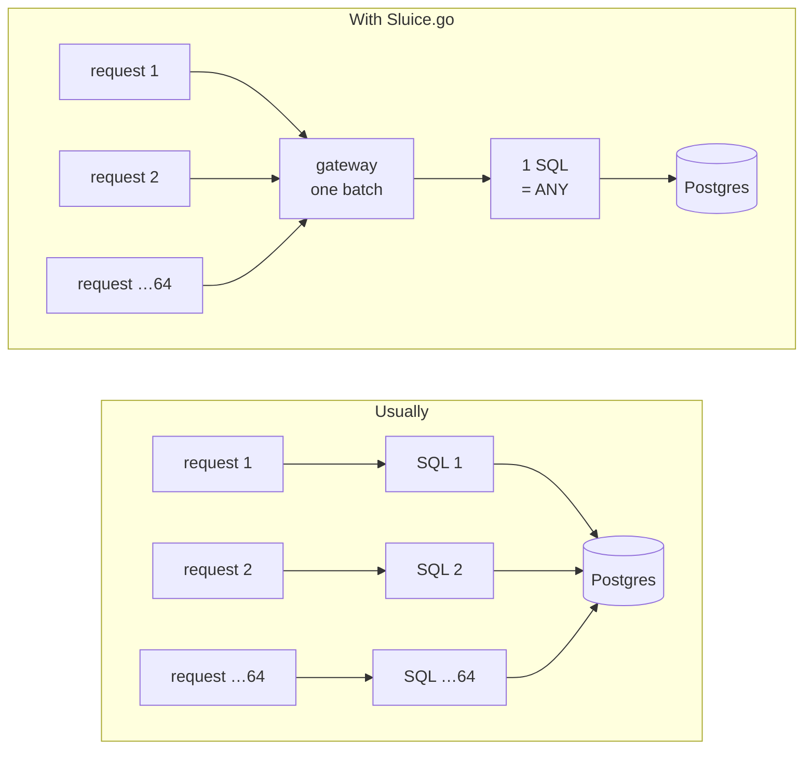
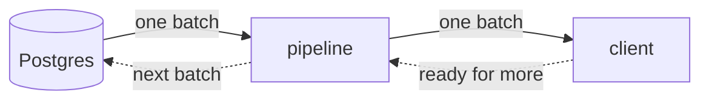

<!-- Badges -->
[](https://pkg.go.dev/github.com/mlagarrigue/sluice)
[](https://github.com/mlagarrigue/sluice/actions/workflows/ci.yml)
[](https://goreportcard.com/report/github.com/mlagarrigue/sluice)


[](LICENSE)

# Sluice.go

**A Go library for writing an application as what it really is: data that
flows.** Bytes arrive from the network, become a request, then a question
asked of the database, then rows, then an answer that leaves. Sluice.go
gives that whole journey one model — the `Stream`, a flow — and one set of
tools to process it. It depends on nothing beyond Go's standard library,
with one exception explained below.

> **v0.1 — not used in production yet.** Everything described here exists,
> is tested and measured; but function names may still change before
> version 1. See [Status and limits](#status-and-limits).

```sh
go get github.com/mlagarrigue/sluice
```

```go
s := sluice.Of(orders, sluice.DefaultBatchSize)                 // a stream from a slice
s = sluice.Filter(s, func(o Order) bool { return o.Total > 0 }) // keep only…
s = sluice.Map(s, applyDiscount)                                // transform each element

for b := range s {              // the reader sets the pace:
    for _, o := range b.Items { // the source produces only what is asked of it
        // ...
    }
}
```

## Motivation

**Go made a rare bet: stay simple without giving up speed.** Rust goes
further in speed and guarantees, but at the price of a complexity most
services do not need. Sluice.go starts from Go's bet and refuses to undo it
with a heavy abstraction layer on top.

**We have lost sight of what our applications do.** A web application, in
the vast majority of cases, is a simple chain: bytes become a request, the
request becomes an SQL query, rows become objects, objects become bytes
again. An *ETL* (a job that extracts data, transforms it and loads it
somewhere else) is the same thing without a browser at the end. Yet each
step usually lives in a different tool — a web framework, an ORM (a layer
that turns objects into SQL), a database driver, an ETL tool — each with
its own model and its own callbacks, and boundaries between them where
throughput is lost and memory overflows.

| Domain | Read as a flow |
|---|---|
| Web | `bytes → Frame → Request → … → Response → bytes` |
| Database | `bytes → Row → Entity` |
| ETL | source → transformations → destination |

**Going one layer down has become reasonable again.** Frameworks get stacked
to avoid writing the code underneath. That code is now far cheaper to write,
read and maintain: tooling has moved the trade-off. What stays expensive is
not knowing what your own stack does when it slows down or falls over.

**A library, not a framework.** The difference: a library is something you
call; a framework calls your code and owns the main loop. Here your program
keeps its `main`, its goroutines (Go's lightweight threads), its sockets and
its lifecycle. No global registry, no mandatory initialisation, no function
to register somewhere. What Sluice.go provides combines with the standard
library (`net`, `crypto/tls`, `io`, `iter`), never replaces it.

**What it covers today**: serving HTTP (over `net/http`, and experimentally
native HTTP/1.1, /2 and /3), reading and writing PostgreSQL (by speaking its
protocol directly, with COPY for bulk loads), grouping simultaneous calls
into one query, and transforming, joining, windowing and deduplicating
streams for ETL — with the same operators everywhere.

**Where it wants to go.** The intent is that an ordinary web application or
ETL pipeline finds here everything from the socket to the database: the
common protocols, databases and message queues, the orchestration of long
jobs. It is not there yet — [Status and limits](#status-and-limits) says what
is missing — but every addition follows the same rule: a package on top of
the core, never inside it.

**Modular.** The core knows none of its extensions. The web, HTTP/1.1, /2,
/3, QUIC and PostgreSQL are packages built on top; other connectors will
follow the same model without touching the core.

## How it works

### Two types, and that is the whole core

```go
type Stream[T any] iter.Seq[Batch[T]]   // a sequence of batches, which the reader pulls
type Batch[T any]  struct { Items []T } // a batch: a slice of values
```

A `Stream` is a standard Go iterator: you walk it with `for range`, you
stop it with `break`, and the stop reaches the source, which releases its
resources immediately. The `[T any]` means `T` is the type of your
elements, whichever you like.

> **In plain terms: why batches?** Handling elements one by one costs a
> small fixed price per element at every stage. Handling them a thousand at
> a time amortises that price: it is paid once per thousand elements. And a
> function that can handle a thousand elements can handle one; the converse
> is false. That is the central idea, and it is measured: about twice as
> fast from two stages on, and far more for the operators that read several
> streams at once.

Everything that happens in an application — reading the network, routing,
authenticating, applying a business rule, querying the database, building
the objects, serialising — is an operator of that same model. There is no
special "handler" in the middle that would be of another nature.

### The packages

| Package | Role | Status |
|---|---|---|
| `sluice` | the core: `Stream`, `Batch`, `Source`, and the operators that keep nothing in memory between two batches | supported |
| `sluice/join` | joins (pairing two streams by a key): they keep one side in memory | supported |
| `sluice/window` | time windows and regrouping with a delay: they keep time | supported |
| `sluice/parallel` | work spread over several goroutines, and the decoupling of two stages | supported |
| `sluice/distinct` | bounded deduplication: it keeps keys | supported |
| `sluice/diagnostics` | errors, warnings and remedies that travel with the data without stopping the stream | supported |
| `sluice/web` | an HTTP request's path over `net/http`: bounded reading, authentication, authorisation, clean shutdown | supported |
| `sluice/gateway` | simultaneous calls grouped into one batch | supported |
| `sluice/database/postgres` | PostgreSQL by speaking its protocol: binary codecs, `= ANY($1)`, COPY | supported |
| `cmd/sluicegen` | generates the code that turns rows into structs | supported |
| `sluice/probe` | counters to find the stage that makes the others wait | supported |
| `sluice/pushdown` | the reader tells the source what it no longer needs | **experimental** — no source listens yet |
| `sluice/net/httpstream` | HTTP/1.1, /2, /3 as stream stages | **experimental** |
| `sluice/web/stream` | the request path for that experimental transport | **experimental** |
| `sluice/net/quic` · `net/quic/udp` | QUIC version 1 (RFC 9000/9001/9002) and its UDP socket | **experimental** |

> **In plain terms: "experimental".** The code exists, is tested and
> measured, but nothing promises it will keep this shape, and it has not
> been confronted with other implementations. The
> [Experimental](docs/guide/experimental.md) guide says exactly what is
> promised and what is not.

## What it does well

Three common situations, what usually happens, and what Sluice.go changes.

### 1. Many requests, few connections

Each HTTP request that needs a row from the database usually makes its own
SQL query. Under load that is as many *round trips* (a question asked of the
database and its answer, one network journey) as requests, and the
*connection pool* (the reserve of open connections to the database)
saturates.



Requests that arrive together leave together. The code that handles one
request does not change. **64 requests, 1 connection, 898 µs** — against
12.9 ms for pgx (the reference PostgreSQL driver in Go) on one connection.
→ [`example/orders`](example/orders)

### 2. A large result, constant memory

Usually the whole result is loaded, then sent: memory grows with the size of
the response, and the client waits for the read to finish before receiving
the first byte.



With Sluice.go the result flows batch by batch, and the client pulls: the
database is read at the pace the client consumes, memory stays the size of
one batch, and if the client leaves, the read stops. *(Native streamed
responses: experimental transport.)*

### 3. A stream that never ends

A continuous job — events, logs, ingestion — usually dies of an *OOM* ("out
of memory": the system kills the process that exhausted memory) the day a
deduplication or a window keeps more state than planned.

With Sluice.go every stage that keeps something in memory takes its
**bound** (its limit) as a required parameter, and says what to do when it
is reached: drop the oldest, drop the newest, or fail loudly. Unbounded
state cannot be written.

## Philosophy

**If I can handle N elements, I can handle 1.** The converse is false. Every
function receives a batch, never a lone element. It costs a little shape up
front and pays everywhere after: merging two streams batch by batch costs a
fraction of a nanosecond per element where an element-wise merge costs
tens, and a single request can join a batch of 64 without the function that
handles it changing.

The other rules follow:

- **Bounded memory** — every limit is a parameter you write, never a hidden
  default.
- **Loud failure** — a silently wrong answer is worse than a crash; an
  overflow raises a diagnostic and a visible counter, never an OOM.
- **Immediate release** — a `break` frees the source at once; it is a tested
  invariant, not a convention.
- **Dependencies by decision** — today the standard library plus
  `golang.org/x/crypto`, for an encryption algorithm `crypto/tls` uses
  without exposing it. Continuous integration refuses any module that no
  recorded decision admitted.
- **Measured, not asserted** — every performance figure has a benchmark and a
  denominator. And never a global "X% faster": a comparison says what it
  compares, in which situation, and where it loses.

## Comparison

Against what Go developers already use, measured on the same machine:

| Compared… | Result |
|---|---|
| serving one HTTP request, against `net/http`, `gin`, `echo`, `chi` | **parity** |
| one PostgreSQL read, against `pgx` | **parity** |
| 64 concurrent requests to PostgreSQL | **same speed with 1 connection instead of 64** |

Sluice.go is not faster per request: it does the same work with far fewer
connections. Detail and method: [measurements](docs/benchmarks.md). The
comparisons against other libraries come from a separate module on the
`benchmarks` branch, which depends on this one and never the reverse, so
none of them enters this module's dependencies.

**A full comparison, with other languages and other approaches, is in
preparation** — scenarios, method and results will be published together.

## Status and limits

- **Nothing has run in production**, and the v0.1 API will change.
- **PostgreSQL only** for now; SCRAM-SHA-256, cleartext and trust
  authentication; codecs for the common types (no `money`, `tsvector`,
  ranges, composites).
- **The native HTTP/QUIC transport is experimental** and has never been
  confronted with another QUIC implementation.
- **No resumption of a long job** after the process dies
  ([architecture](docs/design/architecture.md#a-stage-is-not-a-phase)).

The detail: [limits](docs/guide/limits.md).

## Repository layout

```
sluice/                 the core: Stream, Batch, Source, stateless operators
├── join/ window/       operators grouped by what they keep in memory
│   parallel/ distinct/
├── diagnostics/        diagnostics carried by the stream
├── web/                request path over net/http · web/stream: native (experimental)
├── gateway/            simultaneous calls grouped
├── database/postgres/  PostgreSQL connector
├── net/httpstream/     native HTTP/1.1, /2, /3 (experimental)
├── net/quic/           QUIC v1 (experimental)
├── pushdown/ probe/    upstream demand (experimental) · instrumentation
├── cmd/sluicegen/      generator of hydration code
├── example/            orders (supported path) · vertical (experimental path)
├── internal/           shared machinery, measurement harness, wire protocol
└── docs/               guides, architecture, decisions, measurements
```

## Documentation

Everything starts at [docs/README.md](docs/README.md), organised by what
you want to do: getting started, building, understanding the choices,
contributing. If you are new, start with
[Getting started](docs/guide/getting-started.md): twenty minutes, no
prerequisite beyond Go. The API reference is the godoc, on
[pkg.go.dev](https://pkg.go.dev/github.com/mlagarrigue/sluice), with a
runnable example per operator. Two complete examples:
[`example/orders`](example/orders), the supported vertical against a real
PostgreSQL, and [`example/vertical`](example/vertical), the same over the
experimental transport.

Inspired by the Volcano model, MonetDB/X100, Akka Streams, Flink, and the
FHIR and SARIF diagnostic models — sources cited in the architecture.

Licensed under [Apache 2.0](LICENSE).
